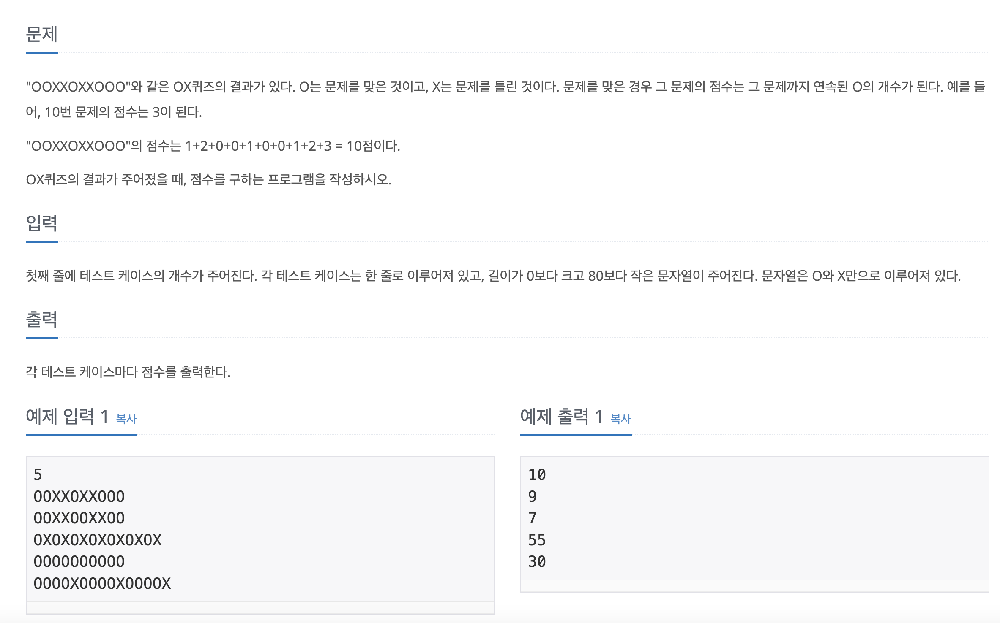

# 8958




```
let num = Int(readLine()!)!
var result : Array<Int> = [] //빈 배열 선언시 자료형 지정
for _ in 0..<num{
    let input = readLine()!.split(separator: "X").map{String($0).count}.map{$0 * ($0+1) / 2}
    result.append(input.reduce(0,+))
}
result.map{print($0)}

```

- 추가 설명
    - 입력받은 문자열을 ‘X’문자를 기준으로 분리하여 컨테이너에 담고 `input`에  다시 반환.
    - `input`의 컨테이너에 별 인덱스에 ’O’의 갯수를 담는다. (EX: [“O”, “OOO”] → [1, 3])
    - 그리고 각 인덱스에 담긴 수의 등차수열 합을 구해 `result`에 담는다. (공식: n * (n+1) /2)
- 클로저 (Closures)
    - Named Closure
        - 일반 함수
    - UnNamed Closure
        - 익명 함수 (EX: `func hi(){ print(”hi”) }` → `{ print(”hi”) }`)
- 고차함수
    - 다른 함수를 인자로 받거나 함수 실행의 결과를 함수로 반환하는 함수
    - 사용대상
        - `Array`, `Dictionary`, `Set`등
    - 사용 이유
        - `for in` 구문에 비해 코드의 간결성 증가
        - 코드 재사용, 컴파일러 최적화 측면에서 성능 향상
    - `map`
        - 자신을 호출할 때 매개변수로 전달된 함수를 실행하고 그 결과를 반환 → 기존 데이터 변형
    - `filter`
        - 컨테이너 값을 특정 조건에 맞게 걸러냄
        - 매개변수로 전달되는 클로저의 리턴타입은 Bool형
    - `reduce`
        - Closure에 따라 기존 컨테이너의 요소를 결합한 결과를 반환
- `input.reduce(0,+)`
    - `for in` 과 같이 0번 인덱스부터 시작해 `input` 배열의 합을 구하여 반환
- `result.map{print($0)}`
    - `for in` 같이 `result` 배열에 접근하여 각 인덱스를 출력